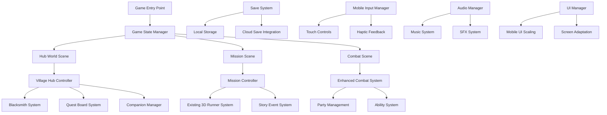

# Design Document

## Overview

This design document outlines the architecture and implementation approach for transforming the current 3D endless runner into "Legends of Aetherion" - a complete lane-based action RPG optimized for Android release. The design maintains the existing 3D lane-based movement system while adding RPG layers including story progression, companion management, crafting systems, and mobile-optimized controls.

The architecture follows a modular approach that allows the existing endless runner mechanics to serve as the core combat engine, while new systems layer on top to provide the full RPG experience described in the Game Design Document.

## Architecture

### High-Level System Architecture



### Core System Integration

The design leverages the existing 3D runner foundation:
- **GameManager3D** becomes the mission controller for story-driven levels
- **Player3D** gains RPG stats, equipment, and companion coordination
- **EnhancedObstacle3D** expands to include story events and interactive elements
- **Combat system** evolves from simple encounters to full tactical battles

## Components and Interfaces

### 1. Game State Management System

**Purpose**: Manages transitions between hub world, missions, and combat states while maintaining save data and progression.

**Key Components**:
- `GameStateManager`: Central controller for scene transitions and state persistence
- `SaveDataManager`: Handles local and cloud save synchronization
- `ProgressionTracker`: Monitors story progress, unlocks, and achievements

**Interfaces**:
```gdscript
class_name GameStateManager extends Node

signal state_changed(old_state: GameState, new_state: GameState)
signal save_completed()
signal load_completed()

enum GameState { HUB, MISSION, COMBAT, MENU }

func transition_to_state(new_state: GameState, context: Dictionary = {})
func save_game_data() -> bool
func load_game_data() -> bool
func get_current_progress() -> ProgressionData
```

### 2. Mobile Input System

**Purpose**: Provides intuitive touch controls optimized for Android devices with haptic feedback and gesture recognition.

**Key Components**:
- `MobileInputManager`: Translates touch gestures to game actions
- `HapticController`: Manages device vibration feedback
- `TouchUIOverlay`: Provides on-screen control elements

**Touch Control Mapping**:
- **Swipe Left/Right**: Lane switching
- **Swipe Up**: Jump action
- **Swipe Down**: Slide action
- **Tap**: Basic attack or interaction
- **Long Press**: Ability activation
- **Two-Finger Tap**: Special ability or pause

**Interfaces**:
```gdscript
class_name MobileInputManager extends Node

signal gesture_detected(gesture_type: GestureType, position: Vector2)
signal haptic_requested(intensity: float, duration: float)

enum GestureType { SWIPE_LEFT, SWIPE_RIGHT, SWIPE_UP, SWIPE_DOWN, TAP, LONG_PRESS, TWO_FINGER_TAP }

func setup_touch_controls()
func enable_haptic_feedback(enabled: bool)
func get_gesture_sensitivity() -> float
func set_gesture_sensitivity(sensitivity: float)
```

### 3. Hub World System

**Purpose**: Provides a central village hub where players manage character progression, interact with NPCs, and select missions.

**Key Components**:
- `VillageHubController`: Manages hub world interactions and NPC behavior
- `BlacksmithSystem`: Handles crafting, equipment management, and upgrades
- `QuestBoardSystem`: Displays available missions and tracks completion
- `CompanionInteractionSystem`: Manages companion conversations and bond building

**Hub Layout**:
- **Central Plaza**: Player spawn point with quest board
- **Blacksmith Shop**: Crafting and equipment management
- **Training Grounds**: Skill tree and ability practice
- **Companion Areas**: Individual spaces for companion interactions
- **Village Outskirts**: Mission departure points

**Interfaces**:
```gdscript
class_name VillageHubController extends Node3D

signal mission_selected(mission_id: String)
signal companion_interaction_started(companion_id: String)
signal blacksmith_accessed()

func initialize_hub(player_data: PlayerData)
func update_available_missions(missions: Array[MissionData])
func trigger_story_event(event_id: String)
```

### 4. Enhanced RPG Player System

**Purpose**: Extends the existing Player3D with RPG mechanics including stats, equipment, abilities, and companion coordination.

**Key Components**:
- `PlayerStats`: Health, mana, attack, defense, and derived stats
- `EquipmentManager`: Weapon and armor management with visual updates
- `AbilitySystem`: Skill trees, cooldowns, and ability execution
- `CompanionCoordinator`: AI companion management and commands

**RPG Extensions**:
```gdscript
class_name RPGPlayer extends Player3D

var stats: PlayerStats
var equipment: EquipmentManager
var abilities: AbilitySystem
var companions: CompanionCoordinator

signal level_up(new_level: int)
signal equipment_changed(slot: EquipmentSlot, item: Equipment)
signal ability_unlocked(ability_id: String)

func gain_experience(amount: int)
func equip_item(item: Equipment, slot: EquipmentSlot) -> bool
func use_ability(ability_id: String) -> bool
func command_companions(command: CompanionCommand)
```

### 5. Companion AI System

**Purpose**: Manages AI companions that fight alongside the player with distinct roles, abilities, and personality systems.

**Key Components**:
- `CompanionAI`: Individual companion behavior and decision making
- `BondSystem`: Relationship tracking and dialogue management
- `CompanionAbilities`: Class-specific abilities and auto-combat behavior
- `FormationManager`: Positioning and coordination in lane-based combat

**Companion Classes**:
- **Tank**: High health, defensive abilities, draws enemy attention
- **Healer**: Support abilities, healing, buff management
- **DPS**: High damage output, offensive abilities, combo attacks

**Interfaces**:
```gdscript
class_name CompanionAI extends CharacterBody3D

var companion_data: CompanionData
var bond_level: int
var current_target: Node3D

signal ability_used(ability_id: String)
signal bond_increased(new_level: int)
signal dialogue_triggered(dialogue_id: String)

func set_combat_role(role: CompanionRole)
func execute_auto_combat(delta: float)
func trigger_bond_conversation() -> DialogueData
```

### 6. Mission and Story System

**Purpose**: Transforms the endless runner into structured story missions with objectives, dialogue, and narrative progression.

**Key Components**:
- `MissionController`: Manages mission objectives and progression
- `StoryEventSystem`: Triggers narrative moments and cutscenes
- `DialogueManager`: Handles character conversations and choices
- `ObjectiveTracker`: Monitors and displays mission goals

**Mission Structure**:
- **Story Missions**: Main campaign progression with narrative
- **Side Quests**: Optional content for materials and companion development
- **Challenge Missions**: Skill-based content with special rewards
- **Replay Missions**: Grindable content for crafting materials

**Interfaces**:
```gdscript
class_name MissionController extends Node

var current_mission: MissionData
var active_objectives: Array[ObjectiveData]

signal mission_started(mission_id: String)
signal objective_completed(objective_id: String)
signal mission_completed(success: bool, rewards: Array[RewardData])

func start_mission(mission_data: MissionData)
func update_objective_progress(objective_id: String, progress: float)
func trigger_story_event(event_id: String, context: Dictionary)
```

### 7. Crafting and Equipment System

**Purpose**: Provides deep equipment customization through material collection and blacksmith crafting.

**Key Components**:
- `CraftingSystem`: Recipe management and item creation
- `MaterialInventory`: Storage and management of crafting materials
- `EquipmentDatabase`: Item definitions, stats, and rarity tiers
- `VisualEquipmentSystem`: Updates player and companion appearance

**Equipment Tiers**:
- **Common**: Basic stats, easy to craft
- **Rare**: Enhanced stats, special materials required
- **Legendary**: Unique abilities, rare materials and high-level crafting

**Interfaces**:
```gdscript
class_name CraftingSystem extends Node

signal item_crafted(item: Equipment, success: bool)
signal recipe_unlocked(recipe_id: String)

func craft_item(recipe_id: String, materials: Dictionary) -> Equipment
func get_available_recipes() -> Array[CraftingRecipe]
func unlock_recipe(recipe_id: String)
func get_required_materials(recipe_id: String) -> Dictionary
```

## Data Models

### Core Data Structures

**PlayerData**:
```gdscript
class_name PlayerData extends Resource

@export var level: int = 1
@export var experience: int = 0
@export var stats: PlayerStats
@export var equipment: Dictionary = {}
@export var abilities: Array[String] = []
@export var skill_points: int = 0
@export var current_chapter: int = 1
```

**CompanionData**:
```gdscript
class_name CompanionData extends Resource

@export var companion_id: String
@export var name: String
@export var class_type: CompanionClass
@export var bond_level: int = 1
@export var abilities: Array[String] = []
@export var equipment: Dictionary = {}
@export var unlocked: bool = false
```

**MissionData**:
```gdscript
class_name MissionData extends Resource

@export var mission_id: String
@export var chapter: int
@export var mission_type: MissionType
@export var objectives: Array[ObjectiveData]
@export var rewards: Array[RewardData]
@export var required_companions: Array[String] = []
@export var story_events: Array[StoryEventData] = []
```

**Equipment**:
```gdscript
class_name Equipment extends Resource

@export var item_id: String
@export var name: String
@export var rarity: EquipmentRarity
@export var slot: EquipmentSlot
@export var stats: Dictionary = {}
@export var special_abilities: Array[String] = []
@export var visual_data: EquipmentVisualData
```

## Error Handling

### Mobile-Specific Error Handling

**Touch Input Errors**:
- Gesture recognition failures fall back to button controls
- Touch sensitivity auto-adjusts based on device capabilities
- Input lag compensation for lower-end devices

**Performance Degradation**:
- Automatic quality scaling when framerate drops below 45fps
- Dynamic LOD system for 3D models and effects
- Memory management with automatic garbage collection triggers

**Save System Failures**:
- Local save backup when cloud save fails
- Save corruption detection and recovery
- Progress validation to prevent save game exploits

**Network Connectivity**:
- Graceful offline mode when cloud services unavailable
- Retry mechanisms for cloud save synchronization
- Local caching of essential game data

### Error Recovery Strategies

```gdscript
class_name ErrorHandler extends Node

enum ErrorType { SAVE_FAILED, PERFORMANCE_DEGRADED, INPUT_FAILED, NETWORK_ERROR }

signal error_occurred(error_type: ErrorType, context: Dictionary)
signal recovery_attempted(error_type: ErrorType, success: bool)

func handle_error(error_type: ErrorType, context: Dictionary)
func attempt_recovery(error_type: ErrorType) -> bool
func log_error_for_analytics(error_data: Dictionary)
```

## Testing Strategy

### Mobile Testing Approach

**Device Testing Matrix**:
- **Low-end**: Android 5.0, 2GB RAM, Adreno 306 GPU
- **Mid-range**: Android 8.0, 4GB RAM, Adreno 530 GPU  
- **High-end**: Android 12+, 8GB+ RAM, Adreno 640+ GPU

**Performance Testing**:
- Sustained 60fps gameplay sessions (30+ minutes)
- Memory usage profiling during extended play
- Battery drain analysis across device types
- Thermal throttling behavior under load

**Touch Control Testing**:
- Gesture recognition accuracy across screen sizes
- Multi-touch handling and palm rejection
- Haptic feedback responsiveness and battery impact
- Accessibility testing for different hand sizes

**Integration Testing**:
- Google Play Services integration (achievements, cloud save)
- Google Play Billing for premium purchase
- Android system integration (notifications, background behavior)
- Cross-device save synchronization

### Automated Testing Framework

```gdscript
class_name GameTestSuite extends Node

func test_save_load_cycle() -> bool
func test_combat_mechanics() -> bool
func test_progression_systems() -> bool
func test_mobile_input_handling() -> bool
func test_performance_benchmarks() -> bool
```

This design provides a comprehensive foundation for transforming the endless runner into a full RPG while maintaining mobile optimization and the unique lane-based combat system that makes the game distinctive.